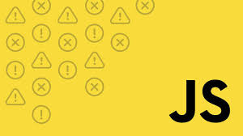

# Advanced Programing: JavaScript
Spring 2020
Chris Stromberg

 

## Project Status

# Kattis Problems
## R2
- [R2](KattisProblems/r2/r2.js)
- [Screenshot](KattisProblems/r2/screenshot.jpg)
- Level 1.2
- Grade 60% due to low difficulty

## Some Sum
- [Some Sum](KattisProblems/SomeSum/someSum.js)
- [Screenshot](KattisProblems/SomeSum/screenshot.jpg)
- Level 1.6
- Grade 80% due to difficulty Level

## Akcija
- [Akcija](KattisProblems/Akcija/akcija.js)
- [Screenshot](KattisProblems/Akcija/screenshot.jpg)
- Level 2.0
- Grade 100%

## Completing the Square
- [Completing the Square](KattisProblems/Completing/complete.js)
- [Screenshot](KattisProblems/Completing/screenshot.jpg)
- Level 2.0
- Grade 100%

## Babelfish
- [Babelfish](KattisProblems/Babelfish/babelfish.js)
- [Screenshot](KattisProblems/Babelfish/screenshot.jpeg)
- Level 2.0
- Grade 100%

# Client-side JS App
- [Html File](Client-sideJSApp/updatedVersion/index.html)
- [CSS File](Client-sideJSApp/updatedVersion/style.css)
- [Java Script File](Client-sideJSApp/updatedVersion/script.js)
- [Readme](Client-sideJSApp/README.md)

# Final Project
- Basic Calculator
- [Html File](FinalProject/index.html)
- [CSS File](FinalProject/style.css)
- [Java Script File](FinalProject/main.js)
- To run just put all three files and image in a folder and click on index.html.
It should just open in your browser. (I do want to make a few more modifications before 
Thursday)